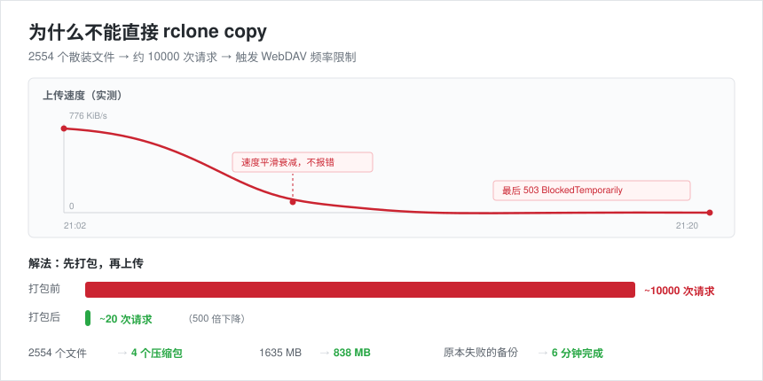

# codex-backup

> 把 Codex 的**全部数据** —— 对话记录、产出的文件、配置 —— 加密备份到你的云盘。
> 一条命令备份，一条命令还原。

[](LICENSE)


---

## 为什么需要它

你在 Codex 里做的每一件事，都存在本机：

- `~/.codex/sessions/` —— 全部对话记录（含每一次工具调用和输出）
- `~/.codex/*.sqlite` —— 会话数据库
- 你用它写出来的**项目文件**（代码、文档、素材）

**电脑坏了，这些全没了。** Codex 官方没有内置备份。

这个项目就是干这个的。

---

## 核心洞察：为什么不能直接 `rclone copy`



这是这个项目唯一真正有价值的技术点，也是你 99% 会踩的坑：

**大多数网盘的 WebDAV 都限制请求频率。** 以坚果云为例：

| | |
|---|---|
| 付费版限额 | **1500 次请求 / 30 分钟** |
| 上传 2500 个散装文件 | 每个文件 3~4 次请求 → **约 1 万次** |
| 结果 | **触发限流** |

限流的症状非常迷惑人：

```
速度从 776 KiB/s 平滑衰减 → 21 KiB/s → 503 B/s → 0 B/s
rclone 进程还活着，但没有报错
最后 API 返回：Too many requests are received recently: BlockedTemporarily
```

**你会以为是网速问题，其实是请求数超了。**

**解法**：先打包成几个大文件，再上传。

```
2554 个文件  →  4 个压缩包
~10000 次请求  →  ~20 次请求
1.6 GB  →  838 MB（文本压缩率极高）
```

> 这个洞察来自一次真实的失败：一次全量备份跑了 12 分钟就被封禁，
> 排查后才发现是请求频率限制，不是带宽。

---

## 它做了什么

| 特性 | 说明 |
|---|---|
| **对话完整备份** | 原始 JSONL + 转成人类可读的 Markdown |
| **数据库一致性快照** | 正在运行的 SQLite 用 `backup API` 出快照，**不碰 `-wal`/`-shm`**，避免云盘同步到半写坏的文件 |
| **跨天会话不漏备** | 按**文件修改时间**筛选（不是目录日期）——一个跨天的长会话，文件仍在起始日期目录里 |
| **凭据硬排除** | `auth.json`、`.sandbox-secrets`、`.secrets.ps1`、`id_rsa`、`.env` 等 18 类，**永不上传** |
| **内容级密钥清除** ★ | 密钥藏在**文件内容**里也能发现 —— 扫描文本、就地打码为 `[REDACTED]` |
| **自动打包** | 绕开 WebDAV 请求频率限制 |
| **加密上传** | 用 rclone crypt 层，云盘里只有乱码 |
| **自包含还原** | 还原脚本就在备份里，换电脑也能恢复 |
| **完整性校验** | 每个文件带 SHA256，还原前自动比对 |

---

## 三层密钥保护

密钥泄漏是最容易犯、后果最重的错误。这个项目用三层防它：

| 层 | 防什么 | 怎么做 |
|---|---|---|
| **① 文件名** | 独立存放的密钥文件 | 18 类文件名 + 4 类通配符（`*.pem` / `*.key` …） |
| **② 配置合并** | 用户自己写配置时**静默丢失**内置保护 | 密钥规则**只能追加，不能被覆盖** |
| **③ 文件内容** ★ | 密钥**被粘贴进对话、文档、配置文件里** | 正则扫描文本，就地打码成 `[REDACTED by codex-backup]` |

**第 ③ 层为什么必须有：**

真实踩坑 —— 用户曾经在对话里粘贴过一次 App Secret，
于是**那条会话记录本身就成了泄漏源**。文件名排除完全挡不住这种。

覆盖的模式：`AppSecret` / `sk-…` / `ghp_…` / `Bearer …` / `xox?-…` / 私钥块。

**设计细节**（都是血泪）：
- **不能要求"密钥值后面紧跟收尾引号"** —— 在 JSONL 里换行是字面的 `\n`，
  值后面往往跟着转义字符而不是引号，加了收尾引号会**漏杀**。
- **私钥要确认后面确实有密钥体**，否则文档里的示例字符串会被**误杀**。

---

## 快速开始

### 0. 前置

- Python 3.9+（3.11+ 更好，内置 `tomllib`）
- [rclone](https://rclone.org/downloads/)
- 一个支持 WebDAV 的网盘（坚果云 / Nextcloud / 群晖 / 自建等）

### 1. 安装

```bash
git clone https://github.com/<you>/codex-backup.git
cd codex-backup
cp config.example.toml config.toml
```

编辑 `config.toml`，至少改这两项：

```toml
[source]
workspaces = ["D:/Documents/MyProjects"]   # 你的项目目录

[general]
output_dir = "D:/CodexBackup"              # 备份产物放哪
```

### 2. 配置云盘（以坚果云为例）

```bash
# 1) 连接网盘（应用密码在 坚果云 → 账户信息 → 安全选项 → 第三方应用管理 里生成）
rclone config create nutstore webdav \
  url "https://dav.jianguoyun.com/dav/" \
  vendor other \
  user "你的邮箱" \
  pass "你的应用密码"

# 2) 加一层加密
rclone config create secret crypt \
  remote "nutstore:CodexBackup" \
  password "你自定义的加密密码" \
  filename_encryption standard \
  directory_name_encryption true

# 3) 建目标文件夹
rclone mkdir nutstore:CodexBackup
```

> ⚠️ **加密密码自己记牢。** 它不会被上传、不会进备份。
> **丢了它，云端数据永远打不开。**

### 3. 备份

```bash
# 首次：全量
python scripts/backup.py --full
python scripts/pack.py --auto full 2026-10-07
rclone copy upload/ secret: --progress

# 之后：每天增量
python scripts/backup.py
python scripts/pack.py --auto daily 2026-10-07
rclone copy upload/ secret: --progress
```

### 4. 还原

```bash
rclone copy secret: ./download --progress
python scripts/restore.py --zips "./download/daily/2026-10-07"          # 预览
python scripts/restore.py --zips "./download/daily/2026-10-07" --apply  # 真正写入
```

**还原前必须完全退出 Codex**，否则会写坏数据库。

---

## 配置说明

| 字段 | 说明 |
|---|---|
| `general.output_dir` | 备份产物目录 |
| `source.codex_dir` | Codex 数据目录（默认 `~/.codex`） |
| `source.workspaces` | 要一并备份的项目目录，可写多个 |
| `exclude.secret_files` | **永不上传**的文件名 |
| `exclude.cache_dirs` | 跳过可再生缓存（`node_modules`、`plugins` 等） |
| `pack.max_part_mb` | 单个压缩包上限，**必须小于网盘的单文件上限** |
| `upload.remote` | rclone 远程名 |

---

## 定时任务

**Windows**（每天凌晨 2 点备份前一天）：

```powershell
$action  = New-ScheduledTaskAction -Execute 'python' `
  -Argument 'D:\GitHub\codex-backup\scripts\backup.py --date (Get-Date).AddDays(-1).ToString("yyyy-MM-dd")'
$trigger = New-ScheduledTaskTrigger -Daily -At 02:00
Register-ScheduledTask -TaskName 'CodexBackup' -Action $action -Trigger $trigger
```

**macOS / Linux**（crontab）：

```cron
0 2 * * * cd /path/to/codex-backup && python scripts/backup.py --date $(date -d yesterday +\%F) && python scripts/pack.py --auto daily $(date -d yesterday +\%F) && rclone copy upload/ secret:
```

---

## 常见问题

**Q: 一定要用坚果云吗？**
不一定。任何 rclone 支持的后端都行（WebDAV / OneDrive / S3 / B2 / R2…）。
只是坚果云的 WebDAV 请求限制最典型，所以拿它举例。

**Q: 加密了还能直接在网盘里看文件吗？**
不能。加密后云盘里是乱码。**如果你需要直接翻阅，把 crypt 层去掉**——
但那样凭据类风险需要你自己承担。

**Q: 备份多大？**
对话文本压缩率极高。实测 1.6 GB 的原始数据打包后 838 MB。

**Q: 单次全量会不会超网盘单文件上限？**
会。所以 `pack.max_part_mb` 默认 450 MB（小于坚果云的 500 MB 上限）。
**打包时按未压缩体积分卷**，保证压缩后一定不超。

**Q: 还原真的可靠吗？**
**请自己做一次还原演练。** 没做过还原演练的备份，不能算备份。
脚本支持 `--zips` 预览模式，不会改动任何东西。

---

## 已知限制

- **主要验证环境是 Windows + 坚果云**。Linux / macOS 由 CI 在真实 runner 上跑端到端测试，但**未经真实云盘验证**。
- **WebDAV 后端**：如果你用对象存储（S3 / R2 / B2），其实不需要打包，直接传也行。
- **不做文件级增量去重**：每天一个完整目录，靠 rclone 自身跳过未变文件。

## 开发

```bash
pip install -r requirements.txt
python tests/smoke_test.py      # 端到端冒烟测试（不需要真实 Codex 环境）
```

CI 在 **Ubuntu / Windows / macOS × Python 3.9 / 3.11 / 3.13** 上运行同一套测试。

---

## License

MIT